# Liminal — Dispatch Waves

51 briefs across 8 clusters, dependency-ordered into waves.
Briefs within a wave can run in parallel. File-conflict notes where relevant.

Greenfield repo — no pre-existing code beyond scaffold stubs, so structural
conflicts between parallel briefs are limited to shared module roots
(mod.rs, lib.rs, Cargo.toml).

## Wave Diagram

```mermaid
graph TD
    subgraph "Wave 1 — Foundation (10 briefs, full parallel)"
        LIM001[LIM-001<br>Crate scaffold + types + errors]
        ROUTING001[ROUTING-001<br>Predicate types + module root]
        ROUTING005[ROUTING-005<br>Backpressure signal types]
        DUR001[DUR-001<br>Durability foundation]
        PROTO001[PROTO-001<br>Frame types + codec]
        AION001[AION-001<br>Aion module foundation]
        SDK001[SDK-001<br>Rust SDK scaffold]
        SRV001[SRV-001<br>Server crate scaffold]
        OBS001[OBS-001<br>Metrics registry]
        OBS006[OBS-006<br>Trace context propagation]
    end

    subgraph "Wave 2 — Core Primitives (25 briefs, full parallel)"
        LIM002[LIM-002<br>Channel actor]
        LIM003[LIM-003<br>Schema + envelope]
        LIM004[LIM-004<br>Conversation actor]
        ROUTING002[ROUTING-002<br>Predicate evaluation]
        ROUTING003[ROUTING-003<br>Compiler + functions]
        ROUTING006[ROUTING-006<br>Pressure policies]
        DUR002[DUR-002<br>Durable channel storage]
        DUR004[DUR-004<br>Dedup contract]
        DUR005[DUR-005<br>Durable conversations]
        PROTO002[PROTO-002<br>Envelope + causal]
        PROTO003[PROTO-003<br>Connection lifecycle]
        PROTO004[PROTO-004<br>Stream multiplexing]
        PROTO006[PROTO-006<br>Schema negotiation]
        AION002[AION-002<br>Activity dispatch]
        AION003[AION-003<br>Signal delivery]
        AION004[AION-004<br>Event streaming]
        SDK002[SDK-002<br>Rust SDK core API]
        SDK003[SDK-003<br>Backpressure + lifecycle]
        SRV002[SRV-002<br>Config loading]
        SRV006[SRV-006<br>Health endpoints]
        OBS002[OBS-002<br>Channel metrics]
        OBS003[OBS-003<br>Conversation metrics]
        OBS004[OBS-004<br>Pressure metrics]
        OBS005[OBS-005<br>Prometheus export]
        OBS007[OBS-007<br>Structured logging]
    end

    subgraph "Wave 3 — Integration (10 briefs, full parallel)"
        LIM005[LIM-005<br>Conversation patterns]
        LIM006[LIM-006<br>Causal ordering]
        ROUTING004[ROUTING-004<br>Dispatch + groups]
        DUR003[DUR-003<br>Cursors + replay]
        PROTO005[PROTO-005<br>Backpressure frames]
        AION005[AION-005<br>Worker registration]
        SDK004[SDK-004<br>Connection pool]
        SDK005[SDK-005<br>Gleam SDK scaffold]
        SDK007[SDK-007<br>TypeScript SDK scaffold]
        SRV003[SRV-003<br>Network listener]
    end

    subgraph "Wave 4 — Completion (5 briefs, full parallel)"
        DUR006[DUR-006<br>Crash recovery]
        SDK006[SDK-006<br>Gleam conversations]
        SDK008[SDK-008<br>TypeScript conversations]
        SRV004[SRV-004<br>Graceful shutdown]
        SRV005[SRV-005<br>Clustering]
    end

    subgraph "Wave 5 — Conformance (1 brief)"
        SDK009[SDK-009<br>Cross-SDK conformance]
    end

    LIM001 --> LIM002
    LIM001 --> LIM003
    LIM001 --> LIM004
    LIM004 --> LIM005
    LIM003 --> LIM006
    ROUTING001 --> ROUTING002
    ROUTING001 --> ROUTING003
    ROUTING005 --> ROUTING006
    ROUTING003 --> ROUTING004
    ROUTING005 --> ROUTING004
    DUR001 --> DUR002
    DUR001 --> DUR004
    DUR001 --> DUR005
    DUR002 --> DUR003
    DUR002 --> DUR006
    DUR003 --> DUR006
    DUR005 --> DUR006
    PROTO001 --> PROTO002
    PROTO001 --> PROTO003
    PROTO001 --> PROTO004
    PROTO001 --> PROTO006
    PROTO004 --> PROTO005
    AION001 --> AION002
    AION001 --> AION003
    AION001 --> AION004
    AION002 --> AION005
    SDK001 --> SDK002
    SDK001 --> SDK003
    SDK002 --> SDK004
    SDK003 --> SDK004
    SDK002 --> SDK005
    SDK002 --> SDK007
    SDK005 --> SDK006
    SDK007 --> SDK008
    SDK004 --> SDK009
    SDK006 --> SDK009
    SDK008 --> SDK009
    SRV001 --> SRV002
    SRV001 --> SRV006
    SRV002 --> SRV003
    SRV003 --> SRV004
    SRV003 --> SRV005
    OBS001 --> OBS002
    OBS001 --> OBS003
    OBS001 --> OBS004
    OBS001 --> OBS005
    OBS006 --> OBS007
```

## File Conflict Analysis

### Wave 1 — No conflicts
All 10 briefs create independent files in separate modules. LIM-001 creates
the crate root; the others create their own module directories.

### Wave 2 — Managed conflicts
- **LIM-002, LIM-003, LIM-004** all modify `crates/liminal/src/channel/mod.rs`
  and `crates/liminal/src/lib.rs`. LIM-002 creates `actor.rs`; LIM-003 creates
  `schema.rs`; LIM-004 creates `conversation/actor.rs`. The mod.rs additions
  are independent `pub mod` lines. **Can run in parallel — mod.rs changes merge
  cleanly.**
- **OBS-002, OBS-003, OBS-004, OBS-005** all depend on OBS-001's registry.
  Each creates its own file. **No conflicts.**
- **SDK-002, SDK-003** both modify SDK lib.rs. Independent module additions.
  **Can run in parallel.**

### Wave 3 — No conflicts
LIM-005 and LIM-006 modify different files. Cross-cluster briefs operate
on separate module trees.

### Wave 4 — No conflicts
All 5 briefs operate on independent module trees.

## Wave Details

### Wave 1 — Foundation (10 briefs)

The scaffolding wave. Every brief creates its module root and foundation types.
No brief depends on another — full parallel.

| Brief | Cluster | Title | R#s | Key Files Created |
|-------|---------|-------|-----|-------------------|
| LIM-001 | core | Crate scaffold + types + errors | 6 | Cargo.toml, lib.rs, channel/types.rs, error.rs |
| ROUTING-001 | routing | Predicate types + module root | 5+ | routing/mod.rs, routing/predicate.rs |
| ROUTING-005 | routing | Backpressure signal types | 5+ | pressure/mod.rs, pressure/signal.rs |
| DUR-001 | durability | Durability foundation | 5+ | durability/mod.rs, durability/error.rs, durability/store.rs |
| PROTO-001 | protocol | Frame types + codec | 5+ | protocol/mod.rs, protocol/frame.rs, protocol/codec.rs |
| AION-001 | aion | Aion module foundation | 5+ | aion/mod.rs, aion/types.rs, aion/error.rs |
| SDK-001 | sdk | Rust SDK scaffold | 5+ | crates/liminal-sdk/Cargo.toml, src/lib.rs |
| SRV-001 | server | Server crate scaffold | 5 | crates/liminal-server/Cargo.toml, src/main.rs, src/error.rs |
| OBS-001 | observability | Metrics registry | 8 | metrics/mod.rs, metrics/registry.rs |
| OBS-006 | observability | Trace context propagation | 9 | tracing/mod.rs, tracing/context.rs, tracing/span.rs |

### Wave 2 — Core Primitives (25 briefs)

The big parallel wave. Each brief depends only on one Wave 1 brief. All 25 can
run simultaneously — the maximum concurrency point.

**Recommended sub-waves for resource-constrained dispatch (10 slots):**
- 2a (10): LIM-002, LIM-003, LIM-004, ROUTING-002, ROUTING-003, DUR-002, PROTO-002, PROTO-003, AION-002, SDK-002
- 2b (10): ROUTING-006, DUR-004, DUR-005, PROTO-004, PROTO-006, AION-003, SDK-003, SRV-002, OBS-002, OBS-003
- 2c (5): AION-004, SRV-006, OBS-004, OBS-005, OBS-007

### Wave 3 — Integration (10 briefs)

Wires the primitives together. Conversation patterns, dispatch groups,
consumer cursors, backpressure frames, SDK deployment modes.

### Wave 4 — Completion (5 briefs)

Recovery, shutdown, clustering, and SDK language completions.

### Wave 5 — Conformance (1 brief)

Cross-SDK behavioural conformance test suite. The final gate.

## Summary

| Wave | Briefs | Cumulative | Max Parallel | Notes |
|------|--------|------------|--------------|-------|
| 1 | 10 | 10 | 10 | All scaffold — no conflicts |
| 2 | 25 | 35 | 25 (or 10+10+5) | Sub-wave if resource-constrained |
| 3 | 10 | 45 | 10 | Integration — no conflicts |
| 4 | 5 | 50 | 5 | Completion — no conflicts |
| 5 | 1 | 51 | 1 | Final gate |

**Total: 51 briefs, 5 waves, max concurrency 25.**
**Critical path: 5 waves deep (LIM-001 → LIM-004 → LIM-005 is the longest chain in core).**

## Aggressive Dispatch Schedule (10 slots)

- Dispatch 1: Wave 1 — all 10 foundation briefs (parallel)
- Dispatch 2: Wave 2a — 10 core primitives (parallel)
- Dispatch 3: Wave 2b — 10 more primitives (parallel, after 2a lands)
- Dispatch 4: Wave 2c — 5 remaining primitives (parallel)
- Dispatch 5: Wave 3 — all 10 integration briefs (parallel)
- Dispatch 6: Wave 4 — all 5 completion briefs (parallel)
- Dispatch 7: Wave 5 — SDK-009 conformance (solo)

**7 dispatch rounds to land all 51 briefs.**

## Review Status

- [x] 51 briefs authored and schema-validated
- [x] check-coverage.py clean across all 8 clusters
- [ ] Larry Mullen Jr brief review (Bono's team)
- [ ] Danger Mouse adversarial review
- [ ] Tom sign-off for dispatch
